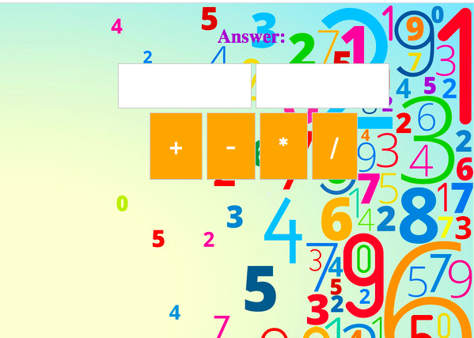

Calculator
Project scope: create a calculator that can take in two input can complete the four different operations.

# Lesson Learned:
*  how to use various methods such as parseFloat
* create function based on DOM element conditions
